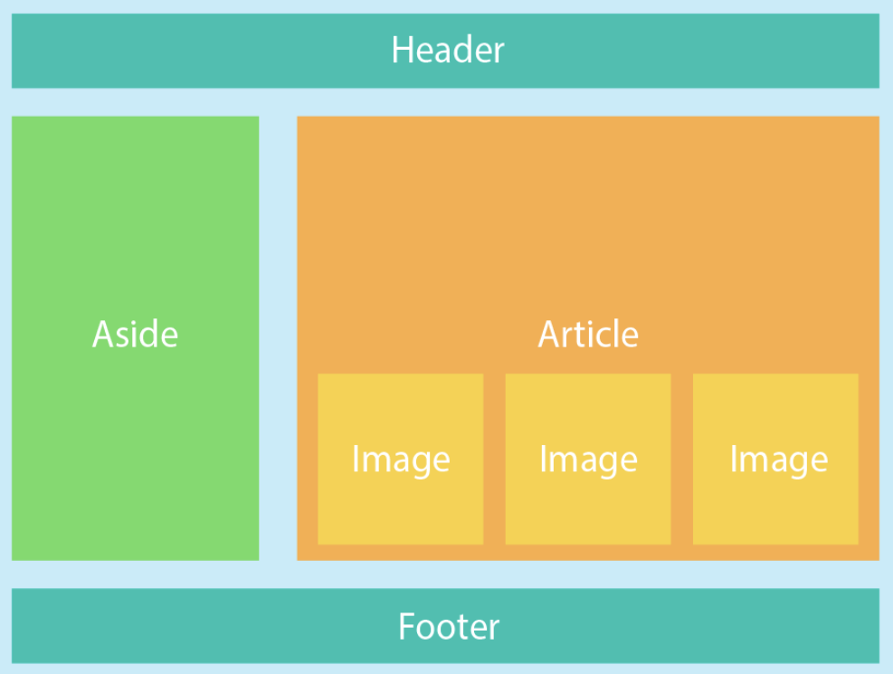

# HTML/CSS Introduction
This project will guide you through how you can use HTML to build web pages. 

## Structure of HTML
The majority of your HTML documents will be made up of tags, which are used to denote HTML elements and define where they are on your page.

In all of the HTML that you will encounter, you will need to add the following tags to begin writing your document:

- `<!DOCTYPE html>`: Used to define the language that is used. The `html` attribute can be changed to use older languages (like HTML4 or XHTML), but for the vast majority of things that you will be doing, this tag will remain the same.
- `<html>`: Used to define the beginning of the HTML code. This is where `<head>` and `<body>` will be nested.
- `<head>`: Used to define the metadata for the document. This is where you would add the title or favicon.
- `<body>`: Used to define the contents of your HTML document. This is where the majority of your code will be.

All together, this is what your HTML documents will look like:

```
<!DOCTYPE html>
<html>
    <head>
        ...
    </head>
    <body>
        ...
    </body>
</html>
```

In this project folder, there is a file called `activity.html` where you will be adding onto for this into project. To open the file in Git Bash, navigate to this folder and type `start ./activity.html`.

You will see that this will open an empty page. For this part of the project, we will be adding titles, favicons, and other pieces of metadata to our template. Complete the following tasks:

- Add a title of your choice to the webpage
- Add a favicon of your choice to the webpage
- Change the author of your webpage to you
- Add a custom description to your webpage

*You won't be able see some of these changes reflected in you web page, why?*

## Elements
While we've learned how to modify the metadata for our site and play around with a few tags, we still have the main part of our HTML page to build out. These are the components that go between the `<body>...</body>` tags and make up what we actually see on our webpage. Each of these components are defined by opening and closing tags along with attributes to define how each of the components function.

These are some of the more common tags that you will encounter:
- `<div>` - A generic HTML container. It is very useful for defining the layout of a page or separating out blocks on elements.
- `<p>` - An HTML paragraph. Used for long blocks of text.
- `<h1>` to `<h6>` - Different levels of header tags. Starting from the largest at `<h1>`, the headers get progressively smaller until `<h6>`.
- `` - HTML element for embedding images.
- `<ul>`, `<ol>`, and `<li>` - Element for different types of lists (ordered, unordered, etc.).

You are able to customize the function of your tags using attributes. Most notably, you are able to use the `style` attribute with many of your tags to change the appearance or formatting of the tag, with each style attribute separated with semicolons. 

Let's add on to the page we've created in the previous section. Fill out the body to create a template for your new wedsite and add some content. Please follow the template given below. Make sure to add the following elements:

- A header with a title
- Some sort of sidebar or navbar
- A main body where you will incorporate **all of the elements above**
- A footer at the bottom'

*Note: For now, just use inline styling*



*Hint: You will want to plan out how your page looks beforehand*

*Hint 2: Flexboxes*

## Javascript
So far we've created a webpage and filled it out with some basic information, but we can't really interact with it in any way. You maybe know that there is a `<button>` tag, but (as far as we know) there's no way for it to do anything. To add functionality to our page, we are able to use Javascript and the `<script>` tag to implement event listeners. 

Inside of your `<body>`, you are able to add `<script>` tags to embed client side Javacript code. These can then be added to certain elements of your page as event listeners that will call the function when the event occurs. For instance, consider the following block of code:

```
<script>
    let d = new Date();
    document.body.innerHTML = "<h1>Today's date is " + d + "</h1>"
</script>
```

Adding this to the body will display today's date in `<h1>` tags. Additionally, you can define the `id` attribute of your elements and refer to that elements using `document.getElementById(id)`. Then, you are able to define a function under `<script>` and attach it to a button's `onclick` event listener. For example, the following will chance the color style attribute of the `<p>` element on a button press.

```
<p id="demo">click on the button</p>
<button onclick="black()">Change to black</button>
<script>
    function black() {
        var el = document.getElementById("demo");
        el.style.color="#000000";
    }
</script>
```

Now lets add some scripts to make your page more interactive. Your task is to add two buttons in your header that will enable a "light" and "dark" mode for your page. These modes should change the background colors and font colors of the page. Feel free to choose your colors as you wish, but make sure to incorporate a variety of different shades for each theme. 

## CSS Styling
styling information

## Big one
 - Take some inspiration from last year for flexboxes
 - This one should cover html, img, hyperlinks, html table, basic javascript (button clicking changing stuff), css styling (padding, margin, size), flexboxes